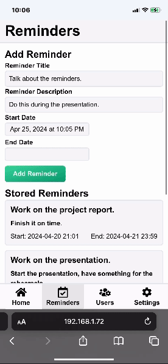

# Raspberry Pi Smart Mirror

### Disclaimer

This repo contains code for the capstone project completed for the Computer Engineering Technology program at NAIT. The original repo is private and is part of the NAIT Oranization on GitHub.

The repo **does not** contain material such as the documentation, instruction manual, progress report, and the final project report. The Github Project with the Issues, Kanban board and timeline is not available.

**This readme will provide a high level overview for the software part of the project. However, GIFs for an early prototype can be found [HERE](./Documents/Photos/Prototype).**

## Technologies used

### Hardware

- Raspberry Pi 5 4GB.
- PAJ7620U2 Gesture Sensor.
- ADXL343 Accelerometer.
- VEML6030 Ambient Light Sensor.
- Custom PIR Sensor Circuit using BS412 and MCP3008 ADC Chip.

### Software

**Client**

- React.js
- Tailwind CSS
- Vite/Node.js
- Weather API

**Server**

- Flask
- SQLite with SQLAlchemy.
- Python for controlling the GPIO on the Raspberry Pi.

### Other Materials

- 3D printed case for the Raspberry Pi.
- Wood used for the mirror frame.
- One-way reflective acrylic used for the mirror. It allows the display to shine through.
- Breadboards, wires, etc.

## Design Overview

### Mirror UI

The mirror UI shows the current time and weather forecast for the selected location, the reminders for the selected user, and the lastest news.

The weather data is retrieved from the [WeatherAPI.com](https://www.weatherapi.com/) and the SVGs used are from [Meteocons GitHub Repo](https://github.com/basmilius/weather-icons). The news data was manually fetched and parsed from RSS feeds provided by CTV and The New York Times.

### Reminders

The gesture sensor is used to scroll through the reminders and to pause and unpause the scrolling of the news feed.

### Mobile View of the Web App

The project uses React Router to differentiate and display the Mirror UI or the Mobile View based on the client IP.

### Home Page

Displays the Socket Status that is used for live updates on the Mirror UI. For example, if the location is changes or a reminder is added.

Also displays the behavior or controls for each of the sensors.

### Reminders Page

Displays the reminders for the selected user and allows the addition or deletion of existing reminders. The changes are instantly reflected on the Mirror UI.

This shows how the user can add a reminder.

### Users Page

Allows the addition of new users and the selection between existing users.

No authentication is used in this project since the app is ran on the Raspberry Pi, and only people on the same Wi-Fi network can access the application.

### Settings Page

**General Settings**

- Set the location for time and weather.
- Change the time between 12-hour and 24-hour formats.

**Display Overrides**

- Change the display brightness manually.
- Turn the display on and off.

**Sensor Settings**

- Toggle the sensors on/off.
- Green indicates it is on and red indicates it is off.

**Clear Database**

- Custom hold button component.
- The user has to hold the button for a set interval for the action to occur.

